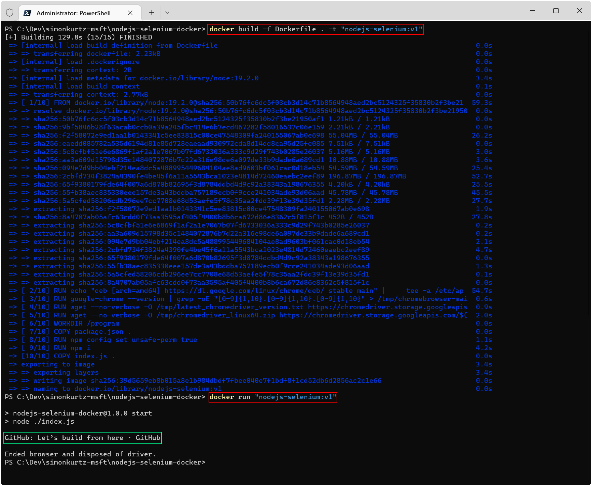

# NodeJS & Selenium

This simple project illustrates how NodeJS and Selenium can be used for website testing. Additionally, the solution can be containerized.

## Getting Started

1. Ensure that you have NodeJS (and npm installed). Run `node -v` in a terminal. If not found, download [NodeJS](https://nodejs.org/en/).
1. Install Google Chrome.
1. Run `npm i` from this directory in a terminal to install all dependencies.
1. Run `npm start` to execute a simple retrieval of a website and its title.

### One-time or Continuous Execution

The `RUN_ONCE` constant at the top of `index.js` can be set to execute the code once and subsequently terminate the container or keep executing on a cron schedule, thereby keeping the container alive.

## Selenium

Selenium recently introduced [Selenium Manager](https://www.selenium.dev/blog/2022/introducing-selenium-manager) which automatically acquires the necessary browser driver. This is a great change as we no longer need to obtain a driver for a particular browser version ourselves. This project focuses on Google Chrome as it remains the world's most used browser, but you can, of course, adapt this to work for other browser as well, which is why I encapsulated the browser setup in its own method.

## Docker

The Docker image is based on the [official NodeJS container image](https://hub.docker.com/_/node). This is a heavier image (~1.6 GB) but is considered the starting point for NodeJS. You may tweak this setup further by using a different base image.

1. Install [Docker Desktop](https://www.docker.com/products/docker-desktop).
1. Run `docker build --platform=linux/amd64 -t chromedriver-test . ` from this directory in a terminal to build the Docker image.
1. Run `docker run -it --platform linux/amd64  --name test chromedriver-test ` to execute the container and see the website title.

